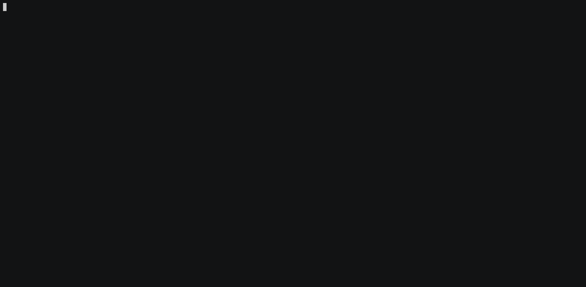

# Home

Welcome to the documentation of Neova ApexRed!

<p align="center">
  
</p>

Check out:

- The [User Guide](./user-guide/getting-started.md), to get started
- The list of [available attack techniques](./attack-techniques/list.md)

<figure markdown>
[](./demo.gif)
<figcaption>Demo of Neova ApexRed. Click to enlarge</figcaption>
</figure>

## Motivation Behind Neova ApexRed

When crafting and implementing threat detection rules, it is essential to have an easy way to execute granular attack techniques, to be able to validate that our detections work as expected.

Think of Neova ApexRed as "[Atomic Red Team](https://github.com/redcanaryco/atomic-red-team)™", but focused on cloud.

Neova ApexRed is a self-contained binary. You can use it to easily detonate offensive attack techniques against a live cloud environment.

```bash title="Sample usage - Stopping a CloudTrail Trail (Defense Evasion)"
neova-apexred detonate aws.defense-evasion.cloudtrail-stop
```

The attack techniques are mapped to [MITRE ATT&CK](https://attack.mitre.org/).
